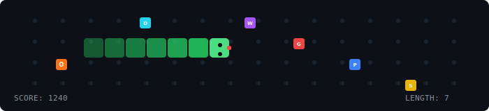

<p align="center">
  
</p>

<p align="center">
  
</p>

---

```ascii
╔══════════════════════════════════════════════════════════════════════╗
║                    PLAYER PROFILE // 0xVSTVB0Y                      ║
╠══════════════════════════════════════════════════════════════════════╣
║                                                                      ║
║  CLASS:      Fusion Middleware Engineer                              ║
║  RANK:       Oracle ACE Associate                                    ║
║  GUILD:      @iConcierge.eg                                         ║
║  SERVER:     Cairo, Egypt                                            ║
║  STATUS:     🟢 ONLINE                                               ║
║  HP:         ████████████████████░░░░░░░ 76/100                      ║
║  XP:         ██████████████████████████░░ 90%                        ║
║  STREAK:     ⚡ 47 days                                               ║
║                                                                      ║
╚══════════════════════════════════════════════════════════════════════╝
```

---

## 🏆 ACHIEVEMENTS UNLOCKED

| BADGE | ACHIEVEMENT | DESCRIPTION |
|-------|-------------|-------------|
| 🏅 | **Oracle ACE Associate** | Recognized by Oracle for technical expertise & community contributions |
| 🥇 | **ECPC 2024 — 1st Place** | Faculty-level competitive programming champion |
| 🥈 | **ECPC 2023 — 2nd Place** | Faculty-level competitive programming runner-up |
| 🔥 | **TryHackMe Top 5%** | Elite ranking among 2M+ cybersecurity learners |
| ☁️ | **OCI Certified** | Oracle Cloud Infrastructure Foundations + Architect Associate |
| 👻 | **Blue Team Operator** | Threat detection, SIEM, and log analysis specialist |

---

## ⚔️ SKILL TREE

### 🟡 PRIMARY WEAPONS
```
ORACLE FMW    ████████████████████░░  92%  [WebLogic/SOA/OSB]
OCI CLOUD     ██████████████████░░░░  85%  [Infra & Architect]
PYTHON        ████████████████░░░░░░  72%  [Automation/Scripts]
JAVASCRIPT    ██████████████░░░░░░░░  65%  [React/Node.js]
```

### 🔵 UTILITY BELT
```
DOCKER        ████████████████░░░░░░  70%
JENKINS       ██████████████░░░░░░░░  60%
GIT           ████████████████░░░░░░  75%
SQL           ██████████████░░░░░░░░  60%
LINUX         ██████████████████░░░░  82%
```

### 🟣 CYBERSEC LOADOUT
```
QRADAR        ████████████████░░░░░░  68%
NMAP          ████████████████░░░░░░  70%
THREAT HUNT   ██████████████░░░░░░░░  62%
SIEM OPS      ████████████████░░░░░░  65%
```

---

## 📜 QUEST LOG

<details open>
<summary><strong>🟢 ACTIVE QUESTS</strong></summary>

| QUEST | LOCATION | STATUS | XP REWARD |
|-------|----------|--------|-----------|
| Software Engineering Intern | @iConcierge.eg | 🔄 In Progress | +5000 XP |
| GDGoC SVU Lead | South Valley University | 🎯 Active | +3000 XP |
| ICPC HUN Vice-Lead | Faculty of CS & AI | 🎯 Active | +2500 XP |

</details>

<details>
<summary><strong>✅ COMPLETED QUESTS</strong></summary>

| QUEST | LOCATION | REWARD |
|-------|----------|--------|
| Cybersecurity Intern | CyberX | 🛡️ Blue Team Badge |
| NASA Space Apps Mentor | NASA Space Apps | 🚀 Cloud Mentor Badge |
| GDG Cybersecurity Head | Hurghada | 🎓 Trained 300+ students |
| Stride Workspace | Personal Project | ⚡ Full-stack Time Mgmt |

</details>

---

## 🎮 MINI-GAME: SNAKE

> *Collect skills, grow stronger!*

Want to play? Check out the [interactive Snake game](snake-game.html) — or run it locally:

```bash
# Clone the profile repo
git clone https://github.com/Vlhoseny/Vlhoseny.git
cd Vlhoseny
# Open snake-game.html in your browser
start snake-game.html
```

**High Score:** 🏆 Beat it if you can!

---

## 📡 CONNECT WITH ME

<p align="center">
  <a href="https://0xvstvb0yportfolio.vercel.app/">
    
  </a>
  <a href="https://www.linkedin.com/in/mohammedabdulrahim-/">
    
  </a>
  <a href="mailto:Mohamedabdulrahim4work@gmail.com">
    
  </a>
  <a href="https://ace.oracle.com/0xVSTVB0Y">
    
  </a>
</p>

---

<p align="center">
  
  
  
</p>

---

```ascii
╔══════════════════════════════════════════════════════════════════════╗
║              PRESS START // GAME OVER — CONTINUE?                    ║
╚══════════════════════════════════════════════════════════════════════╝
```
