  

---

---

## 👻 PAC-MAN CONTRIBUTION GRAPH

<picture>
  <source media="(prefers-color-scheme: dark)" srcset="https://raw.githubusercontent.com/Vlhoseny/Vlhoseny/output/pacman-contribution-graph-dark.svg">
  <source media="(prefers-color-scheme: light)" srcset="https://raw.githubusercontent.com/Vlhoseny/Vlhoseny/output/pacman-contribution-graph.svg">
  
</picture>

---

  <b>0xVSTVB0Y</b> · Fusion Middleware Engineer · Oracle ACE Associate

